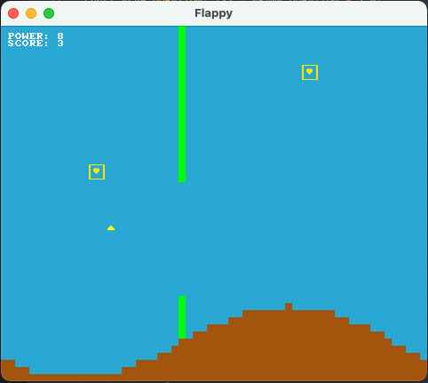

# Flappy

A simple Flappy Bird clone using bracket-lib.

This Flappy Bird clone is developed from the material in "Hands-on Rust" by Herbert Wolverson. It adds simple terrain and power ups to the basic game engine. 

# Power Up

The power ups are randomly pre-generated based on expected maximum game completion. There are 3 levels of power up:

 Level           | Points 
-----------------|--------
 Bronze (Low)    |  5     
 Silver (Medium) | 10     
 Gold   (High)   | 15     

The player consumes a single power point per flap and must fly through a power up to add power.

# Terrain

The terrain is generated using a simple sine wave calculation. Currently there is no guards to prevent the terrain from overlapping a gate in an obstacle.